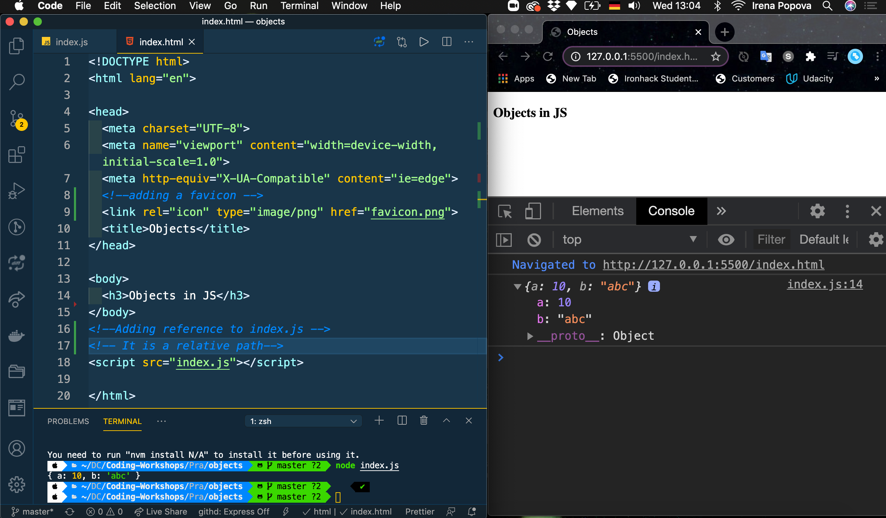

### Set up 
### Create HTML and start live server

#### step one create index.html & index.js file 

### Add favicon and embedded javascript to html file

👉 You can see that JavaScript is embedded in scripts in the html file

 
### JavaScript in Separate file
Notice: 🛑 that the exstention is .js = index.js

 
[I'm an inline-style link](https://www.google.com)
