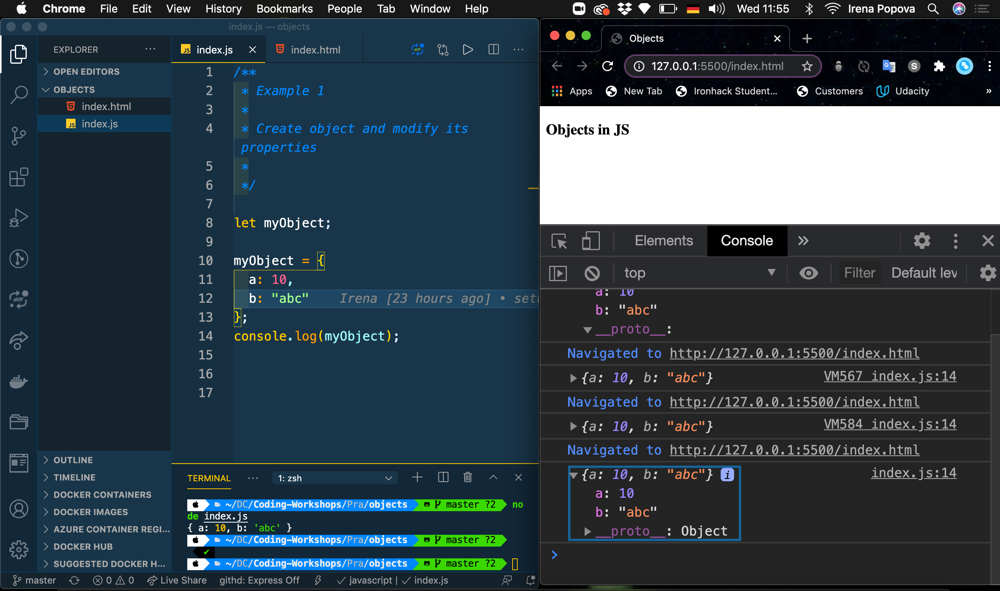
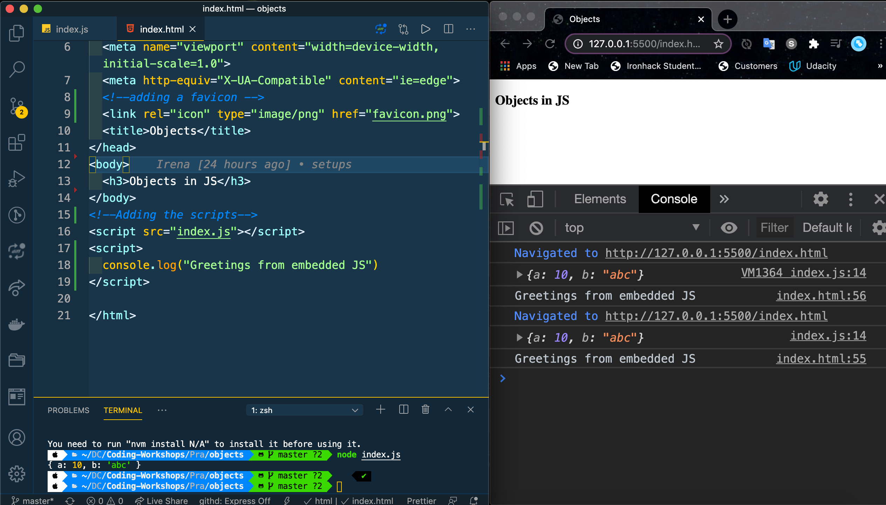

### Set up 
### Create HTML and start live server

#### step one create index.html & index.js file 

### Add favicon to html file

### JavaScript embedded into HTML 

[I'm an inline-style link](https://www.google.com)
