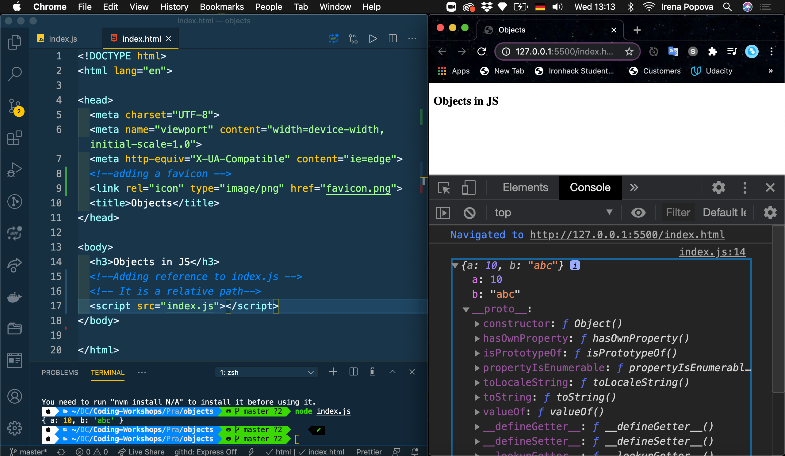

### Set up 
### Create HTML and start live server

#### step one create index.html & index.js file 

### Add favicon and embedded javascript to html file

👉 You can see that JavaScript is embedded in scripts in the html file

 
### JavaScript in Separate file
Notice: 🛑 that the exstension is .js = index.js
In order JavaScript file ìndex.js`to be executed in the browser we need to give in our HTML a relative path:

or inside the body tag 

index.js

 
[I'm an inline-style link](https://www.google.com)
