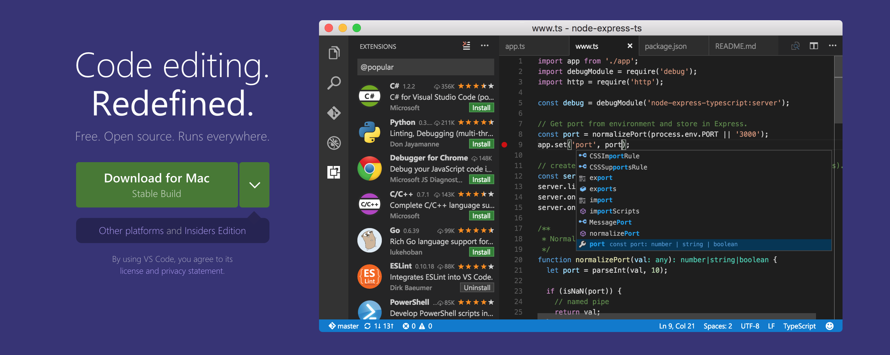
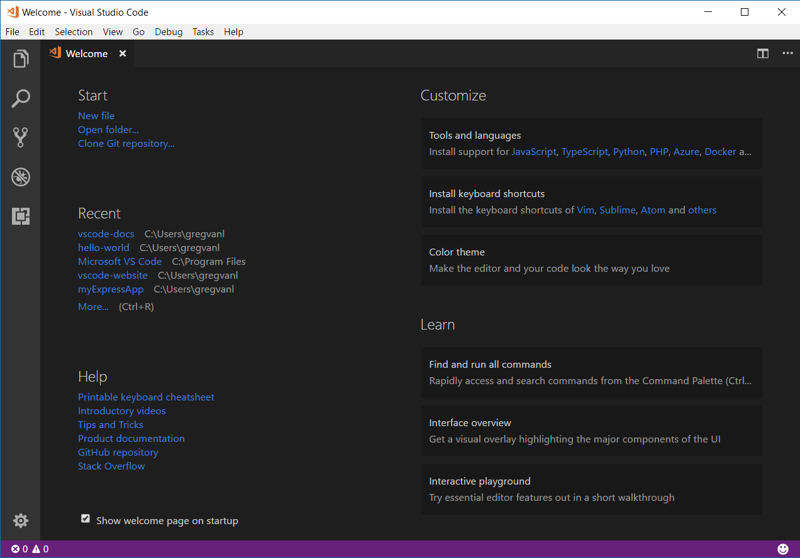
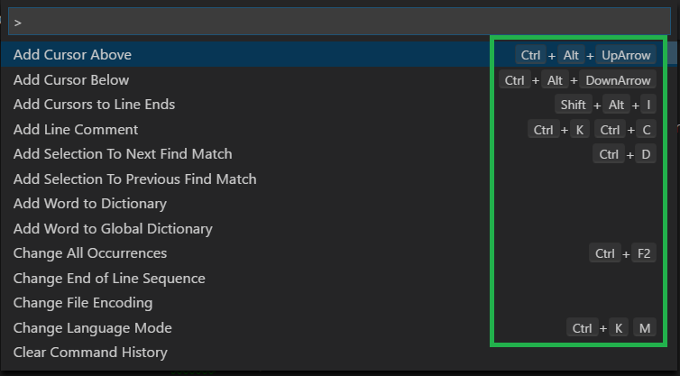
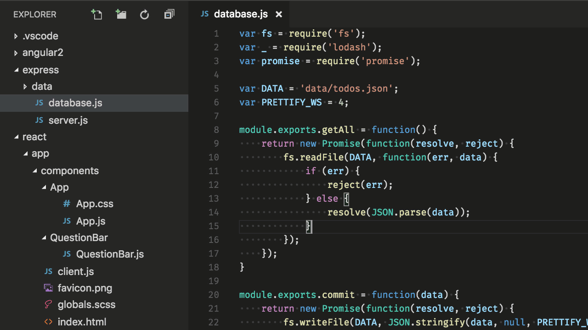
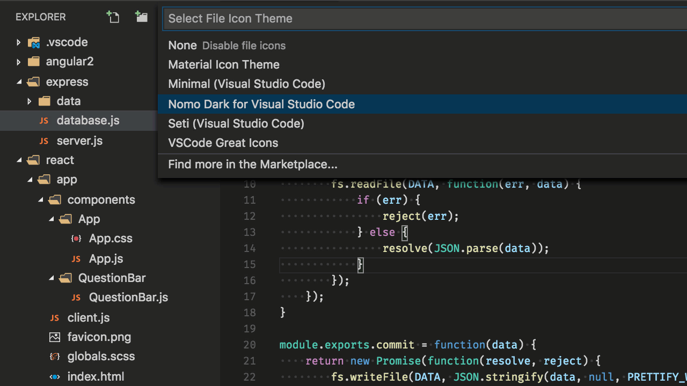
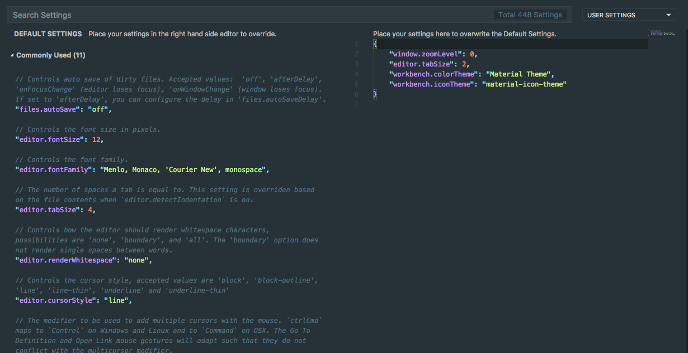
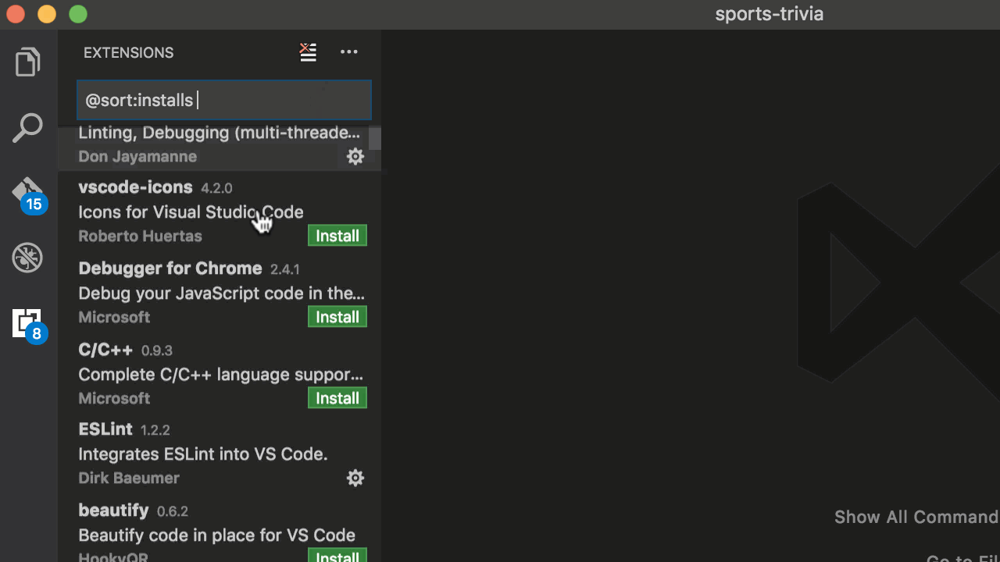
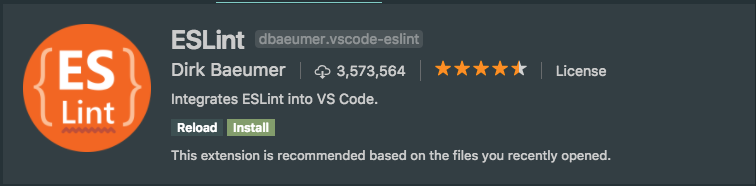
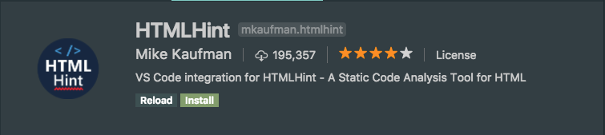

### Introduction
A source code editor is an application that facilitates writing code. It is a text editor, but is specially made for editing source code of computer programs. This will be your fundamental programming tool when writing and editing code.

VSCode is only for writing the code. You will write the code, save it to your file system, and then run the code with a different application, such as Node.js.

### Installation
👉 VSCode’s site will detect our OS automatically. Visit https://code.visualstudio.com/ and download it by clicking on the button to download the application.



### Installing VSCode on Mac
👉 Download the application from https://code.visualstudio.com/.
👉 Extract the zip file you just downloaded in your “Desktop” folder.
👉 Drag the new Visual Studio Code application into your “Applications” folder.
### Installing VSCode on Ubuntu
Use the comand line to download the file:
```js
$ sudo dpkg -i <file>.deb
```
Install Visual Studio Code’s dependencies if they are missing:
```js
$ sudo apt-get -f install
```
### VSCode Configuration
### Getting Started 🤔
Now that VSCode is installed on your system, let’s fire it up, configure it, and get acquainted with the editor.

👉When you launch VSCode for the first time, you will see the Welcome Guide. You can also open the Welcome page to get started with the basics of VS Code. Help > Welcome



### Command Palette
If you press Cmd⌘+Shift+P or Ctrl+Shift+P while focused in an editor panel, the command palette will pop up.


### Default keyboard shortcuts
All of the commands are in the Command Palette with the associated key binding (if it exists). If you forget a keyboard shortcut, use the Command Palette to help you out.



You can download the default keyboard shortcuts for your OS.

[mac OS](https://code.visualstudio.com/shortcuts/keyboard-shortcuts-macos.pdf)

### Customization
👉 Change your theme
You can change the theme by clicking on keyboard shortcut: ⌘K ⌘T or Ctrl+K Ctrl+T and choose the one you prefer.



👉Additionally, you can install and change your File Icon themes.


### You can install more themes from the extension Marketplace.

### Tune your settings
Open the user settings file setting.json (Keyboard Shortcut: ⌘, or Ctrl+,).



For changing any configuration, we should add it at the file on the right.

### VSCode Recommended Configuration

If you want to start coding  set your TabSize configuration to two spaces:

### VSCode Packages
👉 This is one of the interesting things about VSCode. Many of its core features are actually just packages implemented the same way you would implement any other functionality.

👉 Packages that are bundled with VSCode are referred to as Core packages. Ones that aren’t bundled with VSCode are referred to as Community packages. You can download and install packages to add functionalities to your text editor or even develop your own packages.

👉 You can install and manage packages in the Settings view. There you will find your installed packages in the Packages tab.



### VSCode Linters
Let’s install some useful packages for practice.

👉 Linting is the process of running a program that analyses the code for potential errors.

👉 Linter programs automatically find basic mistakes and tell you where they are and how to fix them. It will make your code break less and prevent confusing problems.

👉 Lint was the name originally given to a particular program with a similar functionality in C language source code. Now, the term is applied widely to tools that flag potential errors in any computer language.

👉 In order to improve the functionality of our VSCode environment, let’s install the most useful linter programs.

👉 To install packages in VSCode, navigate to Extensions tab (Cmd⌘+Shift+X or Ctrl+Shift+X).

👉Search for ESLint and HTMLHint packages and click on Install button.



### ⚠️ You should reload VSCode after installation

### Extra Recommended packages
#### 👉 Prettier:
#### 👉 Auto rename tag
#### 👉 Path intellisense

### Extra Resources
[VSCode User Guide 🚀](https://code.visualstudio.com/docs/editor/codebasics)


